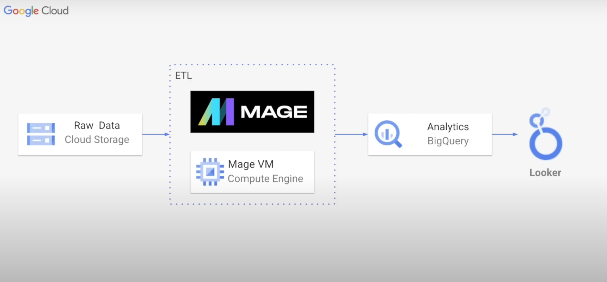
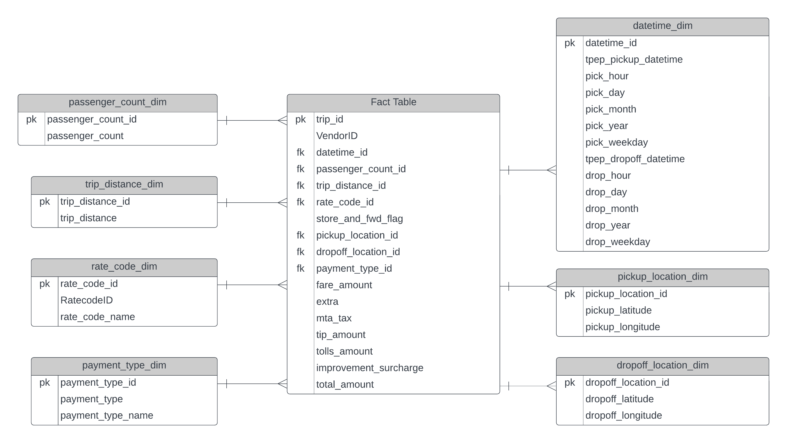
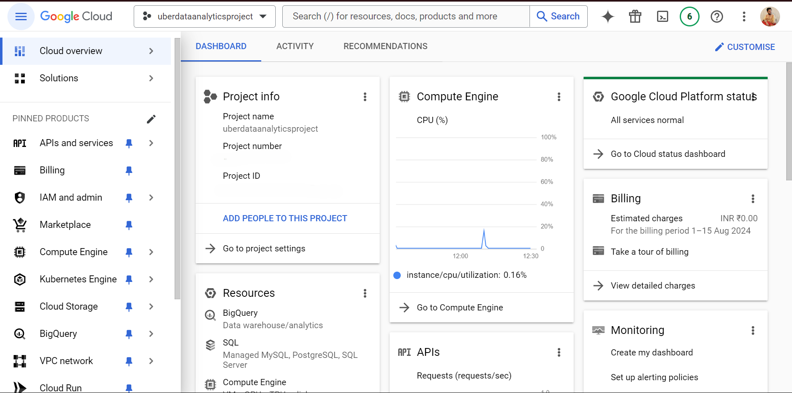
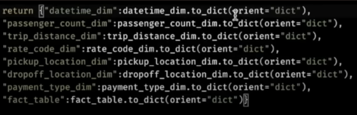
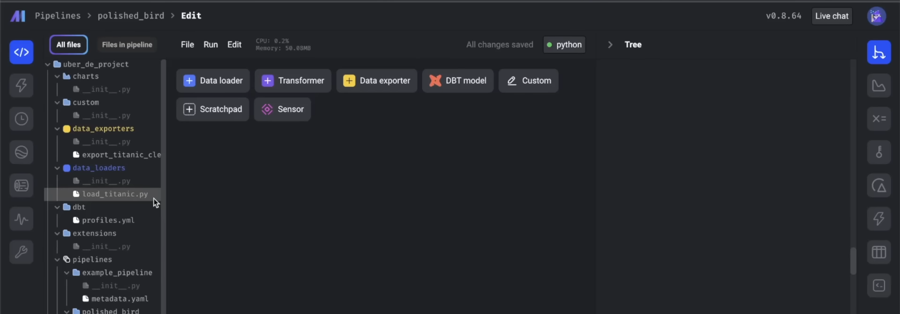

# Uber Data Analytics (Data Engineering ETL Project)

In this project, I designed a comprehensive data engineering solution using an Uber dataset to build a robust data model. I implemented data transformation by writing Python scripts to convert flat files into structured fact and dimension tables. The project was deployed on Google Cloud, utilizing Compute Engine for virtual machines, BigQuery for data warehousing, and Data Studio for creating interactive dashboards. Mage, an open-source tool, was employed for seamless data transformation and integration. This hands-on project not only demonstrates practical skills in Python and SQL but also highlights key data engineering concepts such as dimensional modeling and cloud integration for scalable data solutions.

### Step 1: Designing a Process Flow on GCP

### Step 2: Building an ER Diagram for Uber Data-Flow

### Step 3: Analysing the data in Python (Feature Engineering)
https://github.com/UmairThakur/Uber-Data-Analysis-ETL-PIPELINE-DATA-ANALYSIS_PROJECT/assets/81063457/4208599f-c0a2-4747-ae1b-87751a37de6f

## Step 4: Developing the uber project and a bucket on the Google Cloud Platform, extracting the data, selecting the server and setting up the required permissions.

Note: Project ID and Project Number are hidden intentionally for copyright issues.

## Step 5: Creating a Virtual Machine Instance in GCP using GCP Compute Engine.

## Step 6: Connectting the VM to the Mage Project using SSH Linux Terminal and creating the mage project.

### Step 7: Building a data pipeline with Mage using blocks like data loader, transformer, and exporter (ETL).Incorporate your own extra transformation code into the data transformer, making the necessary adjustments.

### Step 8: After setting up the pipeline, add your GCP credentials to the `io_config.yaml` file. You can obtain these credentials from the APIs and Services section in Google Cloud Console.

### Step 9: Utilize BigQuery to perform ETL operations on the data, making it suitable for analysis such as creating dashboard and generating reports.
https://github.com/UmairThakur/Uber-Data-Analysis-ETL-PIPELINE-DATA-ANALYSIS_PROJECT/assets/81063457/7d03f9af-28c2-405c-a7ea-55dd45cffa1f

### Step 10: Finally, create a dashboard using your preferred dashboarding or reporting tool. I used Google Looker Studio, but you can also opt for other tools like Power BI, Tableau, or Qlik Sense.

## Have a look at my Uber Dashboard- [https://lookerstudio.google.com/s/nQI06ax2wMY](https://lookerstudio.google.com/u/0/reporting/f383c480-7dab-461f-b426-8bbb1df2f13d/page/8pqOD?s=nQI06ax2wMY)
